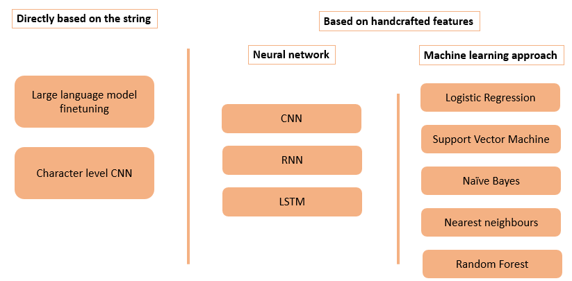

# Phishing URL Detection

Comparison of different ML techniques for the classification of phishing URL.

All details can be found in the project report:
[report.pdf](https://github.com/user-attachments/files/20457060/report.pdf)

